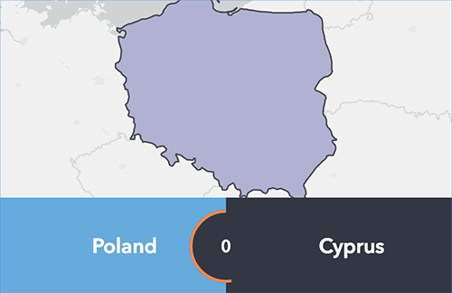

<!-- .slide: data-background="../node_modules/esri-reveal.js-templates/img/2019/devsummit/bg-1.png" data-background-size="cover" style="padding-left: 80px;" -->
<!-- Presenter: Matt -->

# Building Your Own Widget <br />with the ArcGIS JSAPI

## Matt Driscoll – [@driskull](https://twitter.com/driskull)

## JC Franco – [@arfncode](https://twitter.com/arfncode)

---

# Agenda

- Set up dev environment
- Develop
  - Custom Class
  - Simple Widget
  - Custom Widget
- Enhance Custom Widget

---

<!-- Presenter: Franco -->
<!-- .slide: data-background="../node_modules/esri-reveal.js-templates/img/2019/devsummit/bg-4.png" data-background-size="cover" style="padding-left: 80px;" -->

# Setting up the Dev Environment

---

# Developer environment

<!-- background: section/content will tie into widget dev -->
<!-- background: including TS in all steps because it's needed for widget dev -->

JS API + TypeScript

---

# TypeScript

---

# Typed JavaScript

```ts
interface Person {
  name: string;
  age: number;
}

const person: Person = { name: "Franco", age: 33 };

person.age = "24"; // TS2322: Type '"24"' is not assignable to type 'number'
person.height = 5.11; // TS2339: property 'height' does not exist on type 'Person'
```

---

# JS of the future, now

```ts
// let and const
let canChange = 5;
const cannotChange = 5;

// fat arrow functions
const logName = (person) => console.log(person.name);

// template strings
const greeting = `Hello, my name is ${person.name} and I am ${person.age} years old.`;

// destructuring
const { name, age } = person;

// property shorthand
const shorthand = { person };
```

---

# IDE Support

- Visual Studio
- WebStorm
- Sublime Text
- and more!

---

<!-- .slide: data-background="../node_modules/esri-reveal.js-templates/img/2019/devsummit/bg-5.png" data-background-size="cover" style="padding-left: 80px;" -->

# Demo: [Dev Environment](../demos/1-setup/)

- Install TypeScript + JS API

---

<!-- .slide: data-background="../node_modules/esri-reveal.js-templates/img/2019/devsummit/bg-5.png" data-background-size="cover" style="padding-left: 80px;" -->

# Demo Recap: Dev Environment

- Installed TypeScript + JS API typings
- Built mapping application

---

<!-- .slide: data-background="../node_modules/esri-reveal.js-templates/img/2019/devsummit/bg-4.png" data-background-size="cover" style="padding-left: 80px;" -->

# Creating a Class

---

# `esri/core/Accessor`

- JavaScript API foundation <!-- .element: class="fragment" data-fragment-index="0" -->
- Consistent developer experience <!-- .element: class="fragment" data-fragment-index="1" -->

```ts
// unified object constructor
const me = new Person({ name: "Franco", age: 33 });

// watch for changes to `age`
me.watch("age", singHappyBirthday);
```

<!-- .element: class="fragment" data-fragment-index="1" -->

---

<!-- .slide: data-background="../node_modules/esri-reveal.js-templates/img/2019/devsummit/bg-5.png" data-background-size="cover" style="padding-left: 80px;" -->

# Demo: [Custom Class](../demos/2-custom-class/)

```ts
// fetches webmaps from a portal and provides APIs to work with them
interface CustomClass {
  // used to fetch webmaps items
  portal: Portal;
  webMapGroupId: string;

  // active webmap and all fetched ones
  readonly active: PortalItem;
  readonly webMaps: PortalItem[];

  // will be updated with the active webmap
  view: MapView;

  // moves to the next webmap
  next(): void;
}
```

---

<!-- .slide: data-background="../node_modules/esri-reveal.js-templates/img/2019/devsummit/bg-5.png" data-background-size="cover" style="padding-left: 80px;" -->

# Demo Recap: Custom Class

- Implemented `CustomClass`
  - Extended `esri/core/Accessor`
  - Created properties with `@property`
  - Typed constructor arguments
  - Created public + private methods

---

<!-- .slide: data-background="../node_modules/esri-reveal.js-templates/img/2019/devsummit/bg-4.png" data-background-size="cover" style="padding-left: 80px;" -->
<!-- Presenter: Matt -->

# Writing a Widget

---

# About Widgets

- What? <!-- .element: class="fragment" data-fragment-index="1" -->
  - Encapsulated UI components
  - Cohesive (integrated, unified)
  - Single-purpose pieces of functionality
- Why? <!-- .element: class="fragment" data-fragment-index="2" -->
  - Reusable
  - Interchangeable
- How? <!-- .element: class="fragment" data-fragment-index="3" -->
  - Extend `esri/Widgets/Widget`

---

# `esri/widgets/Widget`

- Base widget class (View)
- Extends `esri/core/Accessor`
  - Properties
  - Watching properties
- Lifecycle

---

# Lifecycle

- `constructor`
- `postInitialize`
- `render`
- `destroy`

---

# `render`

- Defines UI
- Reacts to state changes
- Uses JSX (VDOM)

---

<!-- .slide: data-background="../node_modules/esri-reveal.js-templates/img/2019/devsummit/bg-5.png" data-background-size="cover" style="padding-left: 80px;" -->

# Demo: [Simple View](../demos/3-simple-view/)

Write simple widget

---

# Demo Recap: Simple View

- Extended `esri/widgets/Widget`
- Implemented `render()`
- Added a `renderable()` property
- Added `onclick` event
- Added CSS Object + [BEM Methodology](http://getbem.com/)
- Toggled property with event to re-render

---

<!-- .slide: data-background="../node_modules/esri-reveal.js-templates/img/2019/devsummit/bg-4.png" data-background-size="cover" style="padding-left: 80px;" -->

# Improving Our Widget

---

# Architecture

- Separation of concerns
  - Views + ViewModels
  - UI replacement
  - Easier integration

---

# Views

- "Simple widget" example
- Extend `esri/widgets/Widget`
- Rely on ViewModel
- Focus on UI

---

# ViewModels

- "Simple class" example
- Extend `esri/core/Accessor`
- Provide APIs to support View
- Focus on business logic

---

# View + ViewModel in action

<!-- todo: maybe create graphic for this -->

- View renders the state of the VM
  - Looks at properties on VM and renders accordingly
- User interacts with View (property/method)<!-- .element: class="fragment" data-fragment-index="1" -->
  - Causes a change on VM or View
- View updates <!-- .element: class="fragment" data-fragment-index="2" -->
  - Renders again due to changes on VM

---

# Lets create a custom widget

[](../demos/completed/)

Simple Guess Where game

---

# Demo VM Interface

```ts
interface GuessWhereViewModel {
  view: MapView | SceneView;
  state: "splash" | "playing"; // readonly
  choices: Choice[]; // readonly
  points: number; // readonly
  start(): void; // Start the game
  choose(choice: Choice): boolean; // Choose choice returns true/false
  end(): void; // stop game
}
```

```ts
interface Choice {
  name: string;
  feature: Graphic;
}
```

---

# Demo: View Interface

```ts
interface GuessWhere {
  view: MapView | SceneView; // alias of `viewModel.view` property
  viewModel: GuessWhereViewModel;
}
```

---

<!-- .slide: data-background="../node_modules/esri-reveal.js-templates/img/2019/devsummit/bg-5.png" data-background-size="cover" style="padding-left: 80px;" -->

# Demo: [Updated View](../demos/4-updated-view/)

- Use `CustomClass` as `GuessWhereViewModel`
  - Add a state property
- Create `GuessWhere` view
  - Alias VM properties
  - Create BEM classes object
  - Render menu, HUD, round

[updated-view](../demos/4-updated-view/) | [vm-test](../demos/4-updated-view/vm-test.html)

<!--- mention BEM -->

---

# Demo Recap: Update View

- Paired View and ViewModel
- Rendered property from ViewModel
- Wired up interactivity
- Learned to apply styles
- Dynamically rendered UI based on a property value change

---

<!-- Presenter: Franco -->

# Going Further

<!-- .slide: data-background="../node_modules/esri-reveal.js-templates/img/2019/devsummit/bg-4.png" data-background-size="cover" style="padding-left: 80px;" -->

---

<!-- Presenter: Matt -->
<!-- .slide: data-background="../node_modules/esri-reveal.js-templates/img/2019/devsummit/bg-4.png" data-background-size="cover" style="padding-left: 80px;" -->

# Final Recap

- Set up dev environment
- Wrote a custom class
- Developed a custom Widget
- Enhanced a Widget
- Went further

---

## Additional Resources

- [Implementing Accessor](https://developers.arcgis.com/javascript/latest/guide/implementing-accessor/index.html)
- [Setting up TypeScript](https://developers.arcgis.com/javascript/latest/guide/typescript-setup/index.html)
- [Widget Development](https://developers.arcgis.com/javascript/latest/guide/custom-widget/index.html)
- [JavaScript API SDK](https://developers.arcgis.com/javascript/)
- [Styling](https://developers.arcgis.com/javascript/latest/guide/styling/index.html)
- [Widget Patterns](https://github.com/jcfranco/4x-widget-patterns)

---

<!-- **please rate us** -->
<!-- .slide: data-background="../node_modules/esri-reveal.js-templates/img/2019/devsummit/bg-rating.png" data-background-size="cover" style="padding-left: 80px;" -->

---

# Question Time

> 🤔 Where can I find the slides/source?

👉 [bit.ly/buildwidgetsds19](http://bit.ly/buildwidgetsds19) 👈

---

<!-- .slide: data-background="../node_modules/esri-reveal.js-templates/img/2019/devsummit/bg-esri.png" data-background-size="cover" style="padding-left: 80px;" -->

```

```
